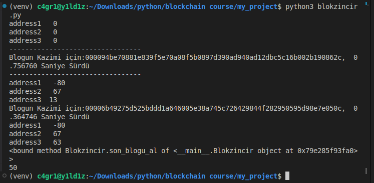
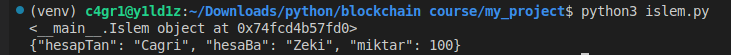

# Block Definition - blok.py

This file defines each block in the blockchain. Blocks store transactions and perform hash calculations. It also includes the process of mining blocks.

## Description

The `Blok` class defines how blocks are created and how hash calculations are performed. Blocks contain the hash value of the previous block, a timestamp, transactions, and a nonce value.

## Usage

This file is used in conjunction with `blokzincir.py` and `blockchain_app.py`. It does not produce any output when run on its own. Follow the steps below to use it in the project.

---

# Blockchain - blokzincir.py

This file contains the `Blokzincir` class which defines the structure of the blockchain. The blockchain maintains blocks in a chain, adds transactions, mines blocks, and verifies the integrity of the chain.

## Description

The `Blokzincir` class creates and manages a blockchain. Blocks are kept in a chain, new transactions are added, and blocks are mined and appended to the chain. It also includes functions to verify the integrity of the blockchain.

## Usage

This file is used in conjunction with `blok.py`, `islem.py`, and `blockchain_app.py`. When run on its own, it adds a few example transactions and performs mining.

## Output

Example of the blockchain status:

---

# Transaction Definition - islem.py

This file defines transactions within the blockchain. Transactions include the sender, receiver, and amount details. The `Islem_Kodlayici` class, which encodes transactions in JSON format, is also defined here.

## Description

The `Islem` class defines how transactions are structured. Transactions include the sender account, receiver account, and transaction amount. The `Islem_Kodlayici` class encodes these transactions into JSON format.

## Usage

This file is used in conjunction with `blok.py`, `blokzincir.py`, and `blockchain.py`. When run on its own, it demonstrates transaction creation and JSON encoding.

## Output

Example of a transaction in JSON format:

